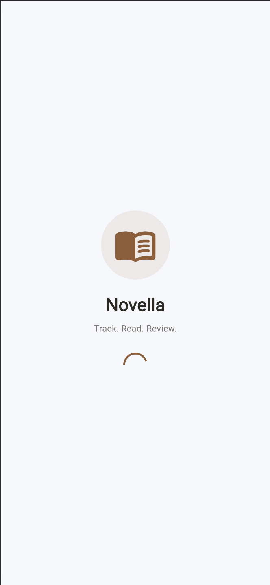
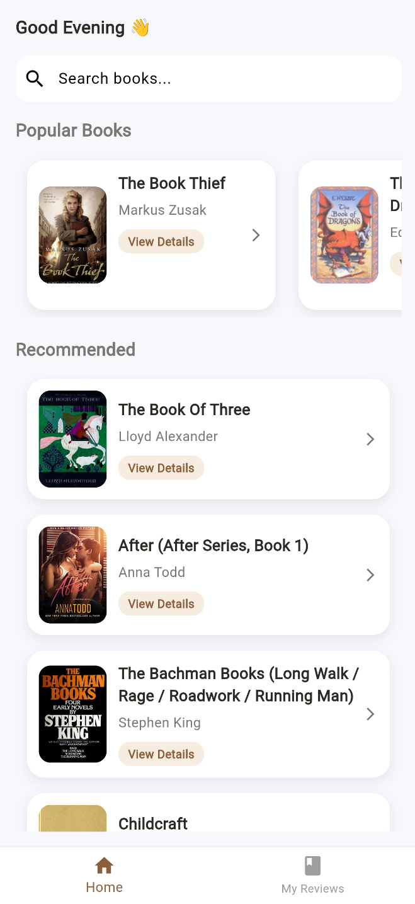
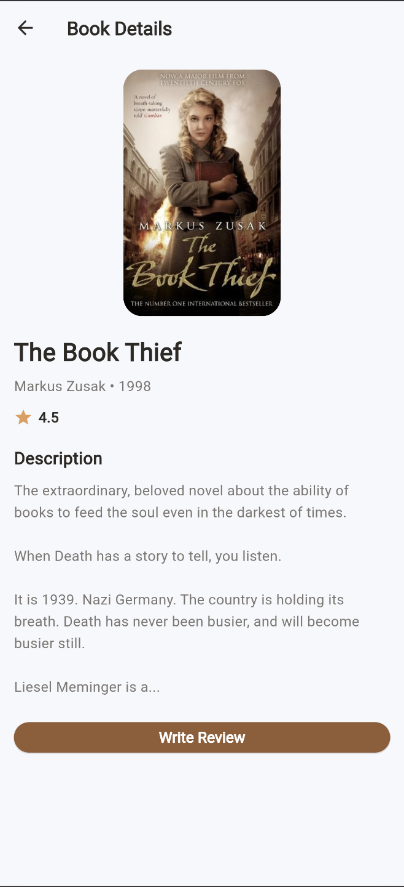
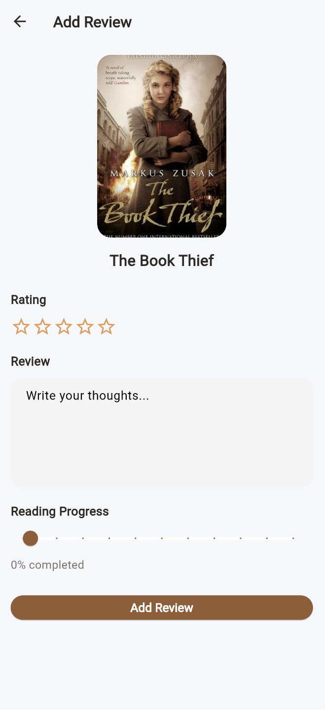
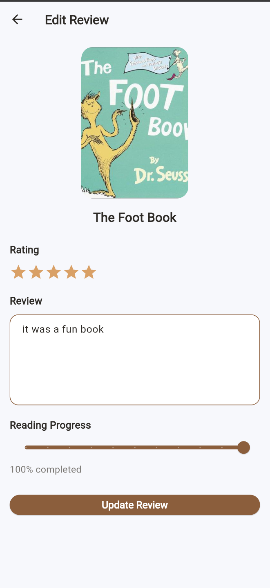
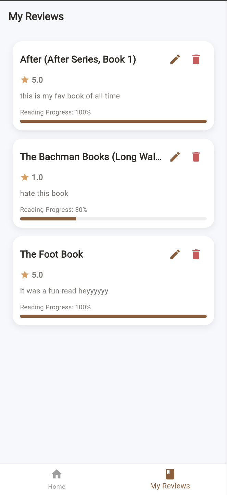

# Novella App

A Flutter application that performs full CRUD (Create, Read, Update, Delete) operations using a public API (MockAPI) and Open Library API for book data.

---

## Features

- Search books using Open Library API
- View detailed book information
- Add reviews for books
- Edit existing reviews
- Delete reviews
- Rating system with progress tracking
- Real-time state updates using Provider
- API integration using HTTP package
- Loading and error handling states
---

## Tech Stack

- Flutter
- Dart
- Provider (State Management)
- HTTP package
- GoRouter (Navigation)
- Open Library API
- MockAPI (for reviews CRUD)

---

## APIs Used

- Open Library API (Books data)
- MockAPI (Reviews CRUD operations)

---

## Notes
This project is part of a Flutter learning assignment.
Data is fetched from public APIs and may vary over time.

## Screenshots

Below are screenshots of the running application:

### Splash Screen

### Home Page

### Book Details Page

### Add Review Page

### Edit Review Page

### My Reviews Page

---

## Author

Hemen Solomon